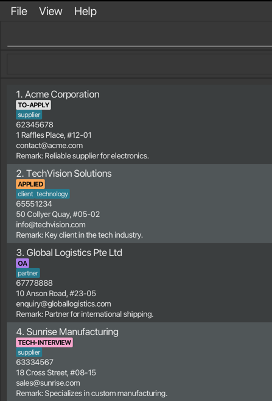

## Introduction

**Cerebro** is built for CS students managing multiple internship applications efficiently through a CLI interface. Ideal for users who type fast, prefer structure, and value productivity over point-and-click workflows.

**Prerequisites:** Basic CLI experience, Java 17+ installed, understanding of internship stages (OA, interviews)

<div markdown="block" class="alert alert-info">
**:information_source: Quick Navigation:**<br>
**New users:** Start with [Quick Start](#quick-start)<br>
**Experienced users:** Jump to [Command Summary](#command-summary)<br>
**Search tip:** Use `Ctrl+F` / `Cmd+F` to find specific commands
</div>


## Table of Contents

Full table of contents for easy navigation through this guide.

* Table of Contents
{:toc}

---

## Quick Start

Installation and first commands to get you started with Cerebro.

### Installation

1. **Check Java Version**

    - Ensure you have Java `17` or above installed
        - If not, [follow these guides](https://se-education.org/guides/tutorials/javaInstallation.html) to install Java 17 on your system
        - **Mac users:** Use the specific JDK version from [here](https://se-education.org/guides/tutorials/javaInstallationMac.html)
    - Verify installation: `java --version` in terminal
2. **Download Cerebro**

    - Download the latest `cerebro.jar` from [here](https://github.com/AY2526S1-CS2103T-F08a-1/tp/releases)
    - Choose a folder as your _home folder_ for Cerebro (e.g. `~/Applications/Cerebro/`)
3. **Launch Application**

   ```bash
   cd /path/to/your/cerebro/folder
   java -jar cerebro.jar
   ```

After running `java -jar cerebro.jar`, you should see a window similar to below, preloaded with sample companies.



---

### CLI Details

Important information about using Cerebro's command line interface.

**Command History:** 

Cerebro is designed for speed and efficiency, just like your favorite terminal! Press `↑` and `↓` to navigate through your command history. Most operations in Cerebro are designed to be easy to type and work with partial matches and case-insensitivity.

**Escaping prefixes with backslash (`\`):** 


You may sometimes want to use slashes in fields like the Remark field, which could be parsed as a parameter prefix. To work around this, use a backslash `\` to escape command prefixes in any parameter.

- `add n/Company r/Meet with Ollie's \s/o` → Remark: "Meet with Ollie's s/o"

Note that parameter prefixes are only registered if they appear immediately after a space! As such, backslashes used in the following way will NOT be removed:

- `add n/\r/Weird Company Name` → Name: "\r/Weird Company Name"

<div markdown="span" class="alert alert-danger">:exclamation: **Warning:**
All operations are permanent! No undo available.
</div>

---

### Command Format

**UPPER_CASE**

Words in `UPPER_CASE` are the parameters to be supplied by the user.<br>
* e.g. in `add n/NAME`, `NAME` is a parameter which can be used as `add n/Google Inc`.

**<ANGLED BRACKETS \| AND PIPE>**

For items in angle brackets, and separated by a pipe `|`, exactly one of the items are required.<br>
* e.g `<INDEX|START-END>` can be used as `1` or as `1-2`.
* e.g `<s/STATUS|t/TAG>` can be used as `s/applied` or as `t/good-pay`.

**[SQUARE_BRACKETS]**

Items in square brackets are optional.<br>
* e.g `n/NAME [t/TAG]` can be used as `n/Google Inc t/tech` or as `n/Google Inc`.

**ELLIPSES…**

Items with `…` after them can be used multiple times including zero times.<br>
* e.g. `[t/TAG]…` can be used as ` ` (i.e. 0 times), `t/tech`, `t/tech t/remote` etc.

**PARAMETERS**

Parameters can be in any order.<br>
* e.g. if the command specifies `n/NAME p/PHONE_NUMBER`, `p/PHONE_NUMBER n/NAME` is also acceptable.
Extraneous parameters for commands that do not take in parameters (such as `help`, `list`, `exit` and `clear`) will be ignored.<br>
* e.g. if the command specifies `help 123`, it will be interpreted as `help`.

<div markdown="span" class="alert alert-warning">⚠️ **Caution:**
If you are using a PDF version of this document, be careful when copying and pasting commands that span multiple lines as space characters surrounding line-breaks may be omitted when copied over to the application.
</div>

---

### Company Fields

Summary of fields available for a Company and their valid values.

<table style="table-layout: fixed; width: 100%;">
  <colgroup>
    <col width="15%"/>
    <col width="45%"/> <!-- Wider Requirements column -->
    <col width="20%"/>
    <col width="20%"/>
  </colgroup>
  <thead>
    <tr>
      <th>Field</th>
      <th>Requirements</th>
      <th>Valid Examples</th>
      <th>Invalid Examples</th>
    </tr>
  </thead>
  <tbody>
    <tr>
      <td><strong>Name</strong></td>
      <td>All ASCII characters allowed, cannot be blank. Case-insensitive: <code>Google</code> is treated the same as <code>google</code></td>
      <td><code>Google</code>, <code>J&amp;J</code>, <code>@Google</code>, <code>Meta!</code></td>
      <td><code> </code>&nbsp;(blank)</td>
    </tr>
    <tr>
      <td><strong>Phone</strong></td>
      <td>At least 3 digits, may start with <code>+</code>, may contain single spaces between digits</td>
      <td><code>98765432</code>, <br><code>+65 9123 4567</code></td>
      <td><code>12</code>, <code>+65 9123&nbsp;&nbsp;&nbsp;4567</code> (extra spaces),<br><code>91+234567</code></td>
    </tr>
    <tr>
      <td><strong>Email</strong></td>
<td markdown="1">
We use the [Apache Commons Validator](https://commons.apache.org/proper/commons-validator/) for email validation, which provides email address validation according to RFC 822 standards.
</td> 
      <td><code>careers@company.com</code></td>
      <td><code>john..doe@example.com</code>, <code>@test</code></td>
    </tr>
    <tr>
      <td><strong>Address</strong></td>
      <td>Free text</td>
      <td><code>123 Main St, #01-01</code></td>
      <td></td>
    </tr>
    <tr>
      <td><strong>Status</strong></td>
      <td>One of: <code>TO-APPLY</code>, <code>APPLIED</code>, <code>OA</code> (Online Assessment), <code>TECH-INTERVIEW</code>, <code>HR-INTERVIEW</code>, <code>IN-PROCESS</code>, <code>OFFERED</code>, <code>ACCEPTED</code>, <code>REJECTED</code>. Case-insensitive: accepts <code>TO-APPLY</code>, <code>to-apply</code>, <code>To-Apply</code>, etc.</td>
      <td><code>APPLIED</code>, <code>offered</code></td>
      <td><code>pending</code>, <code>done</code></td>
    </tr>
    <tr>
      <td><strong>Tag</strong></td>
      <td>Max 30 characters, alphanumeric characters only, single hyphens to separate words. Case-insensitive: <code>BACKEND</code> is treated the same as <code>backend</code>.</td>
      <td><code>remote-work</code>, <code>BACKEND</code>, <code>backend</code></td>
      <td><code>remote work</code>, <code>tech--role</code>, <code>this-is-way-too-long-to-act-as-a-tag</code></td>
    </tr>
    <tr>
      <td><strong>Remark</strong></td>
      <td>Free text</td>
      <td><code>Met at career fair</code></td>
      <td></td>
    </tr>
  </tbody>
</table>

---

### Your First Commands

Let's try some basic operations to get you started with managing your internship applications:

1. **Quick Company Entry**
```
add n/Meta
```

2. **Add Complete Company Details**
```
edit 1 p/98765432 e/careers@meta.com a/1 Hacker Way, Menlo Park
  s/applied t/tech t/remote
```

3. **Search for Companies**
```
find Meta
```

4. **Filter by Application Status**
```
filter s/applied
```

5. **Update Application Progress**
```
edit 1 s/tech-interview r/Scheduled for next Tuesday
```

6. **View Your Application Overview**
```
metrics
```

7. **Reset to See Everything**
```
list
```

---

## Commands

Complete command reference for all Cerebro features.

<div markdown="span" class="alert alert-warning"> 
⚠️ **Caution:** 
Make sure you familiarise yourself with the [Command Format](#command-format) used in this User Guide first!
</div>

### Viewing help: `help`

Shows a message explaining how to access the help page.


<div markdown="span" class="alert alert-primary">:bulb: **Tip:**
You can close the help window with the `ESC` key, `Ctrl/Cmd` + `W` or `alt` + `f4`
</div>

[↑ Back to Top](#table-of-contents)

---

### Listing all companies: `list`

Shows a list of all companies in Cerebro.

* Shows all your tracked companies along with their saved details
* Resets any active filters from previous `find` and `filter` commands
* Shows companies with their current index numbers

[↑ Back to Top](#table-of-contents)

---

### Filtering companies by status and/or tag: `filter`

Finds companies by status and/or tag values. Case-insensitive, lists all companies that **matches** the status AND **matches** **any** of the tags as substrings.

**Format:** `filter <s/STATUS|t/TAG> [t/TAG]…`

**Filter Types**

**Status Filter:** `filter s/STATUS`

**Examples:**
```
filter s/applied  → Shows all companies with "applied" status
```

**Tag Filter:** `filter t/TAG [t/MORE_TAGS]...`

**Examples:**
```
filter t/tech  → Shows companies with tags containing "tech"
                 (e.g. "fintech", "tech-startup")
filter t/tech t/rem  → Shows companies with tags containing "tech" OR "rem"​ 
                       (matches "fintech", "tech-startup",
                        "remote-work", "premium")
```

**Combined Filter:** `filter s/STATUS t/TAG [t/MORE_TAGS]...`

**Examples:**
```
filter s/applied t/rem t/good  → Shows companies with "applied" status AND​
                                  tags containing "rem" OR "good"
```

<div markdown="block" class="alert alert-success">
**Filter Rules:**
* **At least one field required** - Must specify either status or tag(s)
* **Case-insensitive** - `APPLIED` matches `applied`, `FRONTEND` matches `frontend`
* **Substring matching for tags** - `rem` matches `remote-work`, `premium`
* **OR logic for multiple tags** - Any matching tag qualifies
* **AND logic between status and tags** - Must match status AND at least one tag
* **Only 1 status to filter by is allowed** - `filter s/applied s/to-apply` is not allowed
* **Input validation logic follows the same field requirements** - although `remote-` is a substring of `remote-work`, it won't be accepted due to the trailing `-`
</div>

**Result for `filter s/applied t/cl t/og`:**


[↑ Back to Top](#table-of-contents)

---

### Locating companies by name: `find`

Finds companies by matching name substring. Case-insensitive, lists all companies that **contains** the substring.

**Format:** `find SUBSTRING [SUBSTRING]…`

<div markdown="block" class="alert alert-success">
**Search Rules:**
* **Case-insensitive** - `google` matches `Google`
* **Substring order flexible** - `Google Meta` = `Meta Google`
* **Substrings allowed** - `Go` will show `Google`, and all other companies with 'go' in their name
* **OR search** - `Google Meta` finds both `Google Inc` AND `Meta Platforms`
</div>

**Examples:**
```
find Google TikTok  → Google Inc, Google Singapore, TikTok
find goOgl iktO  → Google Inc, Google Singapore, TikTok
```

**Result for `find digital pacific`:**


[↑ Back to Top](#table-of-contents)

---

### Viewing companies metrics: `metrics`

Displays a summary of how your internship applications are distributed across different statuses (e.g. Applied, Offered, Rejected) for all companies you’ve added.

**Result for `metrics`:**


<div markdown="span" class="alert alert-primary">:bulb: **Tip:**
You can close the metrics window with the `ESC` key, `Ctrl/Cmd` + `W` or `alt` + `f4`
</div>

[↑ Back to Top](#table-of-contents)

---

### Adding a company: `add`

Adds a company to Cerebro.

**Format:** `add n/NAME [p/PHONE] [e/EMAIL] [a/ADDRESS] [r/REMARK] [s/STATUS] [t/TAG]…`

**Examples:**
```
add n/Google Inc  → Creates entry with just the name and other fields empty
add n/Meta e/careers@meta.com s/applied  → Adds name, email, and status only
add n/ByteDance p/12345678 e/recruit@bytedance.com​ 
    a/Singapore Science Park r/Fast-growing​ 
    s/tech-interview t/backend t/remote  → Adds complete entry with all details
```

<div markdown="block" class="alert alert-success">
**Usage:**
* **Required:** Company name only
* **Optional:** All other fields
* **Default status:** `to-apply`
* **Tags:** Multiple allowed. Tags are coerced to lowercase on saving (e.g. `Client` becomes `client`).
</div>

<div markdown="span" class="alert alert-primary">:bulb: **Tip:**
Start with just the company name for quick entry when you're researching companies, then update details later with the `edit` command!
</div>

[↑ Back to Top](#table-of-contents)

---

### Editing a company: `edit`

Updates one or more companies in Cerebro.

**Single Edit:** Edit an existing company in the list by updating one or more of its fields

**Format:** `edit INDEX [n/NAME] [p/PHONE] [e/EMAIL] [a/ADDRESS] [r/REMARK] [s/STATUS] [t/TAG]…​`

**Examples:**
```
edit 1 p/91234567 e/careers@google.com  → Updates phone of company 1 to 91234567​ 
                                          and email to careers@google.com
```

**Batch Edit:** Edit multiple companies with the same changes

**Format:** `edit <INDEX|START-END> [INDEX]… [START-END]… [p/PHONE] [e/EMAIL] [a/ADDRESS] [r/REMARK] [s/STATUS] [t/TAG]…​`

| Method | Format | Requirements           | Example | Result |
|--------|--------|------------------------|---------|--------|
| **Comma-separated** | `edit INDEX,INDEX,INDEX [fields]` | No trailing commas     | `edit 1,3,5 s/rejected` | Edited 3 companies (indices 1, 3, 5) - Status updated to rejected |
| **Range** | `edit START-END [fields]` | START ≤ END, inclusive | `edit 2-4 s/applied` | Edited 3 companies (indices 2, 3, 4) - Status updated to applied |

<div markdown="span" class="alert alert-primary">:bulb: **Tip:**
You can combine both methods in one command! Use `edit 1,3,6-8,10 s/applied` to edit companies 1, 3, 6, 7, 8, and 10 all at once.
</div>

**Clear any field:** Use empty value to clear

**Examples:**
```
edit 3 t/  → All tags cleared
edit 3 r/  → Remark cleared
edit 3 t/ r/  → Both tags and remark cleared
```

<div markdown="block" class="alert alert-danger">:exclamation: **Important - Field Replacement:**
All fields are **REPLACED**, not added to existing values.

**Examples:**
edit 1 t/tech → Removes all existing tags, sets only "tech"

edit 1 r/New remark → Completely replaces existing remark

edit 1 t/ → Clears all tags

</div>


<div markdown="block" class="alert alert-danger">
**:exclamation: Important - Index Reference:**<br>
Indices refer to the numbers shown in the **current displayed list**.<br>
After using `find` or `filter`, indices 1,2,3 refer to the 1st, 2nd, 3rd companies in the filtered results, not the original full list.
</div>

**Examples:**
```
list  → edit 2 (edits 2nd company from full list)
find Goog  → edit 1 (edits 1st company from search results)
filter s/applied  → edit 1-3 (edits 1st, 2nd, 3rd company from filtered results)
```

**Rules:**
- At least 1 field must be specified
- Indices must be positive integers within the current list size (e.g. if 5 companies shown, use indices 1-5 only)
- Duplicate indices are not allowed (e.g. `edit 1,1,2` or `edit 1,3,2-4` will throw an error)
- Space between indices are not allowed (e.g. `edit 3555`, not `edit 3 555`)
- Maximum of 10,000 companies can be edited in a single batch operation (e.g. ranges like `1-10001` will be rejected) [See FAQ for rationale](#batch-limit-faq)
- Single editing: All fields allowed
- Batch editing: All fields allowed except Name (prevents creating duplicate company names)
- Tags provided during add or edit are coerced to lowercase and stored in lowercase.

<div markdown="span" class="alert alert-primary">:bulb: **Tip:**
Use batch editing after applying: `edit 1-10 s/applied` updates all at once!
</div>

[↑ Back to Top](#table-of-contents)

---

### Deleting a company: `delete`

Removes one or more companies from Cerebro permanently.

**Single Delete:** Deletes 1 company

**Format:** `delete INDEX`

**Examples:**
```
delete 2  → Deletes Company 2
```

**Batch Delete:** Delete multiple companies in one operation

**Format:** `delete <INDEX|START-END> [INDEX]… [START-END]…`

| Method | Format | Requirements                | Example | Result |
|--------|--------|-----------------------------|---------|--------|
| **Comma-separated** | `delete INDEX,INDEX,INDEX` | No spaces between indices   | `delete 1,3,5` | Deleted 3 companies (indices 1, 3, 5) |
| **Range** | `delete START-END` | START ≤ END, inclusive | `delete 2-4` | Deleted 3 companies (indices 2, 3, 4) |

<div markdown="span" class="alert alert-primary">:bulb: **Tip:**
You can combine both methods! Use `delete 1,3,6-8,10` to delete companies 1, 3, 6, 7, 8, and 10 all at once.
</div>


<div markdown="block" class="alert alert-danger">
**:exclamation: Important - Index Reference:**<br>
Indices refer to the numbers shown in the **current displayed list**. After using `find` or `filter`, indices 1,2,3 refer to the 1st, 2nd, 3rd companies in the filtered results, not the original full list.
</div>

**Examples:**
```
list  → delete 2 (deletes 2nd company from full list)
find Goog  → delete 1 (deletes 1st company from search results)
filter s/applied  → delete 1 (deletes 1st company from filtered results)
```

**Rules:**
- Indices must be positive integers within the current list size (e.g. if 5 companies shown, use indices 1-5 only)
- Duplicate indices are not allowed (e.g. `delete 1,1,2` or `delete 1,3,2-4` will throw an error)
- Space between indices are not allowed (e.g. `delete 3555`, not `delete 3 555`)
- Maximum of 10,000 companies can be deleted in a single batch operation (e.g. ranges like `1-10001` will be rejected) [See FAQ for rationale](#batch-limit-faq)

<div markdown="span" class="alert alert-danger">:exclamation: **Warning:**
This action cannot be undone! Company data will be permanently deleted.
</div>

[↑ Back to Top](#table-of-contents)

---

### Clearing all entries: `clear`

Clears all companies from Cerebro.

Format: `clear`

<div markdown="span" class="alert alert-danger">:exclamation: **Warning:**
This action cannot be undone! All company data will be permanently deleted.
</div>

[↑ Back to Top](#table-of-contents)

---

### Exiting the program: `exit`

Exits the program.

Format: `exit`

[↑ Back to Top](#table-of-contents)

### Saving the data

Cerebro data is saved in the hard disk automatically after any command that changes the data. There is no need to save manually.

### Editing the data file

Cerebro data is saved automatically as a JSON file `[JAR file location]/data/Cerebro.json`. Advanced users are welcome to update data directly by editing that data file.

<div markdown="span" class="alert alert-warning">⚠️ **Caution:**
If your changes to the data file make its format invalid, **Cerebro will discard all data and start with an empty data file at the next run. Hence, it is recommended to take a backup of the file before editing it.**
<br>Furthermore, certain edits can cause Cerebro to behave in unexpected ways (e.g. if a value entered is outside of the acceptable range). Therefore, edit the data file only if you are confident that you can update it correctly.
</div>

### Upcoming Features
- Undo changes: Quickly revert mistaken edits or deletions
- Reminders: Stay on top of application deadlines with a new deadline field for companies (`d/DEADLINE`) and a `remind` command to view upcoming deadlines and overdue applications

---

## FAQ

Common questions and troubleshooting for using Cerebro.

**Q: What happens if I add a company with the same name?**

**A**: Company names must be unique (case-insensitive). Cerebro rejects duplicates and shows an error message.

**Q: How do I track multiple roles at the same company?**

**A**: Use tags to differentiate positions (`edit t/Google SWE` vs `edit t/Google PM`) or/and add respective role details in remarks.

**Q: Can I undo a delete or clear operation?**

**A**: No, deletions are permanent and cannot be undone within the app. To recover deleted data:
1. Close Cerebro
2. Navigate to `[JAR location]/data/` folder
3. Replace `Cerebro.json` with your backup file
4. Restart Cerebro

**Prevention tip:** Regularly backup your `Cerebro.json` file before making major changes.

**Q: How do I transfer my data to another computer?**

**A**: Install Cerebro on the new computer, then overwrite the empty data file with your<br>existing `[JAR location]/data/Cerebro.json`.

<a id="batch-limit-faq"></a>
**Q: Why is there a limit of 10,000 companies for batch edit and delete operations?**
**A**: This limit balances performance and usability considerations:
- **Performance**: Large batch operations can cause significant lag or memory issues that may crash the application due to Java's memory limitations
- **Safety**: Prevents accidental large-scale edits or deletions that could unintentionally affect your entire dataset
- **Practicality**: It's extremely rare for users to legitimately need to edit or delete 10,000+ companies at once in typical internship tracking scenarios, as most users would never have more than 10,000 internship applications

In the rare case whereby you need to perform operations on more than 10,000 companies, consider breaking them into smaller batches.

**Q: Can I edit the JSON file directly?**

**A**: Yes, advanced users can edit `Cerebro.json` directly. **Always backup first** - invalid format will cause Cerebro to discard all data.

**Q: How do I regenerate the dummy data?**

**A**: Delete the `Cerebro.json` file in the `/data` folder, then run the app again. **Make sure to backup any important information first!**

--------------------------------------------------------------------------------------------------------------------

## Command Summary

Quick reference table for all Cerebro commands.

### Viewing Commands

Action | Format | Examples
--------|--------|----------
**[List](#listing-all-companies--list)** | `list` | `list`
**[Filter](#filtering-companies-by-status-andor-tag-filter)** | `filter <s/STATUS|t/TAG> [t/TAG]…` | `filter s/in-process`,<br>`filter t/remote-friendly t/good-pay`,<br>`filter s/applied t/tech`
**[Find](#locating-companies-by-name-find)** | `find SUBSTRING [SUBSTRING]…` | `find Google Meta`

### Action Commands

Action | Format | Examples
--------|--------|----------
**[Add](#adding-a-company-add)** | `add n/NAME [p/PHONE] [e/EMAIL] [a/ADDRESS] [r/REMARK] [s/STATUS] [t/TAG]…​` | `add n/Google Inc`,<br>`add n/Meta p/65432100 e/careers@meta.com`,<br>`add n/Apple r/Great benefits s/applied`
**[Edit](#editing-a-company--edit)** | `edit <INDEX|START-END> [INDEX]… [START-END]… [n/NAME] [p/PHONE] [e/EMAIL] [a/ADDRESS] [r/REMARK] [s/STATUS] [t/TAG]…​` | `edit 1 p/91234567 e/googlehr@gmail.com s/applied`,<br>`edit 1,2,4-8 s/applied t/tech`
**[Delete](#deleting-a-company--delete)** | `delete  <INDEX|START-END> [INDEX]… [START-END]…` | `delete 3`, `delete 1,3,5-8`
**[Clear](#clearing-all-entries--clear)** | `clear` | `clear`

### Other Commands

Action | Format | Examples
--------|--------|----------
**[Help](#viewing-help--help)** | `help` | `help`
**[Metrics](#viewing-companies-metrics-metrics)** | `metrics` | `metrics`
**[Exit](#exiting-the-program--exit)** | `exit` | `exit`
